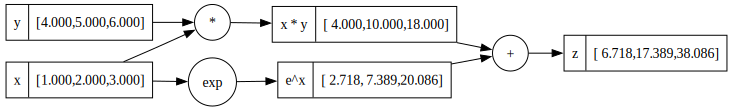
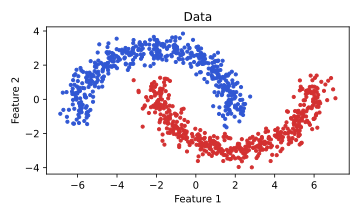
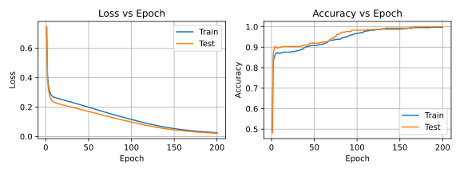
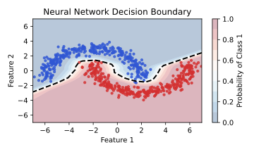

# 👶🏻 🔥 TinyTorch: A minimal automatic differentiation library

TinyTorch is a minimal implementation of [automatic differentiation](https://en.wikipedia.org/wiki/Automatic_differentiation) in Python, designed to demonstrate the core concepts behind modern deep learning frameworks like PyTorch. By focusing on essential functionality, it provides clear insights into how automatic differentiation works in practice. This repo was greatly inspired by [micrograd](https://github.com/karpathy/micrograd), and extends it's functionality from scalars to [tensors](https://en.wikipedia.org/wiki/Tensor).

## Features

TinyTorch provides the fundamental building blocks needed for automatic differentiation:
- Tensor operations `(+, -, *, /, **, @, sum, min, max, log)` with automatic gradient tracking
- Basic neural network activation functions
- Broadcasting support for scalar operations
- Type safety through annotations and strict checking
- Comprehensive property-based testing
- Collection of examples for building neural networks using tinytoch

## Development

TinyTorch is built with modern Python tools:
- Python 3.11+ for type hints and modern features
- [NumPy](https://numpy.org/) for efficient array operations
- [Ruff](https://github.com/astral-sh/ruff) for formatting and linting
- [MyPy](http://mypy-lang.org/) for static type checking
- [Pytest](https://docs.pytest.org/) and [Hypothesis](https://hypothesis.works/) for robust testing
- [PyTorch](https://pytorch.org/) for gradient verification

Create a local venv using
```bash
make venv
```

and install requirements with
```bash
pip install -r requirements.txt
```

## Testing

TinyTorch uses [property-based testing](https://en.wikipedia.org/wiki/Property_testing) with Hypothesis to ensure correctness. The test suite verifies:
- Mathematical properties like commutativity and associativity
- Numerical stability across operations
- Type safety and error handling
- Gradient correctness against PyTorch
- Broadcasting behavior
- Complex computational graphs

Run tests with
```bash
make tests
```

## Theory and Implementation

### Automatic Differentiation Basics

Automatic differentiation (AD) is distinct from both symbolic and numerical differentiation. While symbolic differentiation manipulates mathematical expressions and numerical differentiation uses finite differences, AD computes derivatives by decomposing expressions into elementary operations and applying the chain rule systematically.

AD has two primary modes:
- **Forward mode**: Computes derivatives alongside values during forward evaluation
- **Reverse mode**: Records operations during forward pass, then computes derivatives backward (this is what TinyTorch implements)

The reverse mode is particularly efficient for functions with many inputs and few outputs, making it ideal for neural networks where we typically compute gradients of a scalar loss with respect to many parameters.

### Building the Computational Graph

Every operation in TinyTorch creates a node in a [directed acyclic graph](https://en.wikipedia.org/wiki/Directed_acyclic_graph) (DAG). When you write expressions like `z = x + y`, TinyTorch automatically tracks these operations through [operator overloading](https://en.wikipedia.org/wiki/Operator_overloading). Each node represents an operation (addition, multiplication, etc.), and edges show how data flows between operations.

### Forward and Backward Passes

During the forward pass, TinyTorch performs the actual computations while building the graph. For each operation, it:
- Computes the result using NumPy
- Creates a new tensor to store the result
- Records the operation type and input tensors
- Defines how to compute gradients for this operation

The backward pass ([backpropagation](https://en.wikipedia.org/wiki/Backpropagation)) is where the magic happens. Starting from the output, TinyTorch:
1. Builds a [topologically sorted](https://en.wikipedia.org/wiki/Topological_sorting) list of operations
2. Sets the initial gradient to 1.0
3. Walks backward through the graph
4. Applies the chain rule at each step

### The Chain Rule in Practice

The [chain rule](https://en.wikipedia.org/wiki/Chain_rule) is the key to automatic differentiation. Each operation knows how to compute its local derivatives, and TinyTorch combines these to compute full gradients. For example, in multiplication `z = x * y`:
```python
# Forward: z = x * y
# Backward:
# dz/dx = y  (partial derivative with respect to x)
# dz/dy = x  (partial derivative with respect to y)
```

The chain rule allows us to compute gradients through arbitrary compositions of functions. For a composition like `f(g(x))`, the derivative is `f'(g(x)) * g'(x)`. TinyTorch extends this to handle multivariate functions and complex computational graphs automatically.

### Broadcasting and Gradient Accumulation

TinyTorch handles two crucial aspects of gradient computation:
- [Broadcasting](https://numpy.org/doc/stable/user/basics.broadcasting.html) allows operations between tensors of different shapes
- Gradient accumulation ensures correct gradients when a tensor is used multiple times in the computation (following the [multivariate chain rule](https://en.wikipedia.org/wiki/Chain_rule#Higher_dimensions))

For example, a bias vector `(n,)` broadcast with a matrix `(m,n)` expands that vector across each of the `m` rows. However, in backprop, these expanded dimensions must be *summed away* so gradients match the original shapes. For instance:

- **Forward**: `(n,)` is broadcast to `(m,n)`
- **Backward**: We must sum the gradient `(m,n)` over the `(m)` dimension to get `(n,)`

We solve this with a small helper often called `sum_to_shape`. It systematically collapses any broadcasted dimensions by:

1. **Right-aligning** shapes (matching numpy’s trailing-dimension broadcasting).
2. **Expanding** if the gradient has fewer dimensions than needed.
3. **Summing out** dimensions if the gradient has more dimensions than needed.
4. **Summing** within each axis where the original tensor had size 1.

This ensures that any gradient is accurately *folded* back into the original tensor’s shape, preserving correct gradient accumulation for both scalars and multi-dimensional tensors alike.


## Implementation Details

The core of TinyTorch is the `Tensor` class:
```python
class Tensor:
    def __init__(self, data, label=None, _children=None, _op=None):
        self.label = label  # Name of tensor
        self.data = data  # The actual values (numpy array)
        self.grad = np.zeros_like(data)  # Gradient storage
        self._children = set() # Input tensors
        self._op = op  # Operation type
        self._backward = lambda: None  # Gradient computation function
```

During backpropagation, TinyTorch performs a [topological sort](https://en.wikipedia.org/wiki/Topological_sorting) to ensure gradients are computed in the correct order:
```python
def backward(self):
    topo = []
    visited = set()

    def _build_topo(v):
        if v not in visited:
            visited.add(v)
            for child in v._children:
                _build_topo(child)
            topo.append(v)

    _build_topo(self)
    self.grad = ones_like(self.data)
    for tensor in reversed(topo):
        tensor._backward()
```

### Operation Implementation Example: Addition

Let's look at how TinyTorch implements tensor addition to understand how operations work:

```python
def __add__(self, other: TensorLike) -> Tensor:
    other = _cast_tensor(other)  # Convert to Tensor if needed
    out = Tensor(
        self.data + other.data,  # Forward computation using numpy
        None,                    # No label for result
        (self, other),           # Track input tensors as children
        Operation.ADD            # Record operation type
    )

    def _backward():
        self._broadcast_backward(out.grad)      # dL/dx = dL/dz * dz/dx = dL/dz * 1
        other._broadcast_backward(out.grad)     # dL/dy = dL/dz * dz/dy = dL/dz * 1

    out._backward = _backward  # Attach backward function to output tensor
    return out
```

This implementation showcases several key concepts:

1. **NumPy Integration**:
   - We use NumPy's efficient array operations for the actual computation (`self.data + other.data`)
   - The result is wrapped in a new `Tensor` object to maintain gradient tracking
   - This pattern lets us leverage NumPy's speed while adding automatic differentiation

2. **Computational Graph Building**:
   - Each operation creates a new tensor node
   - Input tensors are stored as `_children` for gradient backpropagation
   - The operation type is recorded for debugging and visualization

3. **Gradient Function Definition**:
   - A `_backward` function is defined that knows how to compute local gradients
   - For addition, both inputs have a local derivative of 1
   - The function is stored but not executed until backpropagation

4. **Broadcasting Support**:
   - The `_broadcast_backward` helper handles gradient computation when tensors of different shapes are added
   - It ensures gradients are properly accumulated when dimensions are broadcast

5. **Chain Rule Implementation**:
   - During backpropagation, `out.grad` contains dL/dz (gradient from above)
   - Multiplying by local derivatives (1 in this case) implements the chain rule
   - Gradients accumulate in the input tensors' `.grad` attributes

This pattern is repeated for all operations, with each implementing its specific forward computation and backward gradient calculation.

## Example Usage

Here's a simple example that demonstrates the key features:
```python
from tinytorch import Tensor

# Create tensors
x = Tensor([1.0, 2.0, 3.0], label="x")
y = Tensor([4.0, 5.0, 6.0], label="y")

# Forward pass builds the computational graph
z = x * y + x.exp()

# Backward pass computes all gradients
z.backward()

# Access gradients
print(x.grad)  # dz/dx = y + exp(x)
print(y.grad)  # dz/dy = x

# Render a graph visualization
z.render()
```


*Example of a computational graph showing the forward and backward pass through operations*

## Neural Network Components

TinyTorch implements a hierarchical neural network architecture consisting of three main components:

### 1. Neuron

The fundamental building block of neural networks. Each neuron performs a weighted sum of its inputs followed by a non-linear activation function:

```python
# Create a neuron with 4 inputs using tanh activation
neuron = Neuron(n_input=4, activation=Activation.TANH)

# Forward pass with batch of 3 samples
x = Tensor(np.random.randn(3, 4))  # shape: (batch_size=3, n_input=4)
output = neuron(x)  # shape: (batch_size=3, 1)
```

### 2. Layer

A collection of neurons that process input in parallel. Each neuron in a layer operates independently on the same input:

```python
# Create a layer with 6 neurons, each taking 4 inputs
layer = Layer(n_input=4, n_neurons=6, activation=Activation.RELU)

# Forward pass
x = Tensor(np.random.randn(3, 4))  # shape: (batch_size=3, n_input=4)
output = layer(x)  # shape: (batch_size=3, n_neurons=6)
```

### 3. Multi-Layer Perceptron (MLP)

[Multilayer perceptrons](https://en.wikipedia.org/wiki/Multilayer_perceptron) (MLPs) are a class of feed-forward [artificial neural networks](https://en.wikipedia.org/wiki/Artificial_neural_network) that can learn non-linear relationships between inputs and outputs through supervised learning. They consist of at least three layers:

1. **Input Layer**: Receives the raw input features
2. **Hidden Layer(s)**: Learns intermediate representations
3. **Output Layer**: Produces the final prediction

```python
# Create an MLP for MNIST digit classification
mlp = MLP(
    n_input=784,  # 28x28 input image
    layers=[
        (128, Activation.RELU),    # hidden layer: 128 neurons with ReLU
        (10, Activation.SIGMOID),  # output layer: 10 neurons (one per digit)
    ]
)

# Forward pass
x = Tensor(np.random.randn(32, 784))  # batch of 32 images
output = mlp(x)  # shape: (32, 10) - probabilities for each digit
```

### Activation Functions

TinyTorch supports several activation functions, each serving different purposes:

1. **[ReLU (Rectified Linear Unit)](https://en.wikipedia.org/wiki/Rectifier_(neural_networks))**
   - Computed as `max(0, x)`
   - Simple, computationally efficient, helps with vanishing gradient

2. **[Sigmoid](https://en.wikipedia.org/wiki/Sigmoid_function)**
   - Computed as `1 / (1 + e^{-x})`
   - Outputs between 0 and 1, useful for binary classification

3. **[Tanh (Hyperbolic Tangent)](https://en.wikipedia.org/wiki/Hyperbolic_functions#Hyperbolic_tangent)**
   - Computed as `(e^x - e^{-x}) / (e^x + e^{-x})`
   - Outputs between -1 and 1, zero-centered

4. **Linear (Identity)**
   - Simply defined as identify `f(x) = x`
   - No non-linearity, useful for regression tasks or final layer


## Training Example: Binary Classification

This example demonstrates how to use TinyTorch to train a binary classifier on the [moon dataset](https://scikit-learn.org/stable/modules/generated/sklearn.datasets.make_moons.html) from scikit-learn. The complete implementation can be found in [examples/classifier.ipynb](./examples/classifier.ipynb).

### Dataset

The moon dataset is a synthetic binary classification problem that creates two interleaving half circles. This dataset is particularly useful for demonstrating non-linear decision boundaries, as the classes cannot be separated by a simple line.




### Model Architecture

We use a multilayer perceptron (MLP) with a deeper architecture to capture the non-linear decision boundary:
- **Input layer:** 2 features (x and y coordinates)
- **First hidden layer:** 24 neurons with ReLU activation
  - ReLU helps prevent vanishing gradients and allows for sparse activation
- **Second hidden layer:** 12 neurons with ReLU activation
  - Multiple hidden layers enable hierarchical feature learning
- **Output layer:** 1 neuron with Sigmoid activation
  - Sigmoid squashes output to [0,1] for probability interpretation

```python
mlp = MLP(
    n_input=2,
    layers=[
        (24, Activation.RELU),    # first hidden layer
        (12, Activation.RELU),    # second hidden layer
        (1, Activation.SIGMOID),  # output layer
    ]
)
```

### Training Loop Implementation

The training process implements maximum likelihood estimation through gradient descent optimization. We use:
- [Binary cross-entropy loss](https://en.wikipedia.org/wiki/Cross_entropy#Cross-entropy_loss_function_and_logistic_regression) (negative log likelihood)
- Simple [gradient descent](https://en.wikipedia.org/wiki/Gradient_descent) for parameter updates

```python
# Training loop
for epoch in range(epochs):
    # Forward pass
    y_train_probs = mlp(X_train)

    # Zero gradients before backward pass
    mlp.flush_grads()

    # Binary cross-entropy loss (negative log likelihood)
    neg_logl_train = -(
        y_train * y_train_probs.log() +
        (1 - y_train) * (1 - y_train_probs).log()
    ).sum() / len(y_train)

    # Backward pass
    neg_logl_train.backward()

    # Update parameters with gradient descent
    for param in mlp.parameters:
        param.data += -learning_rate * param.grad
```

### Key Components

1. **Initial Gradient Setting**:
   - Recall that is set to `neg_logl_train.grad = 1.0` before calling `backward()`
   - This provides the starting point for the chain rule in backpropagation
   - Since we're differentiating a scalar loss, its derivative with respect to itself is 1
   - Without this initialization, gradients would all be zero during backpropagation

2. **Loss Function**:
   The negative log likelihood ([binary cross-entropy](https://en.wikipedia.org/wiki/Cross-entropy)) is used because:
   - It's the [proper scoring rule](https://en.wikipedia.org/wiki/Scoring_rule) for binary classification
   - It encourages confident predictions for correct classes
   - Its gradient provides optimal updates for probability estimates
   - For binary classification with `y ∈ {0,1}`, it simplifies to:
     `L = -[y log(p) + (1-y)log(1-p)]`
   - This loss has strong theoretical foundations in information theory and maximum likelihood estimation

3. **Parameter Updates**:
   - Simple gradient descent updates parameters in the direction that reduces the loss
   - The update rule is: `θ = θ - η ∇L(θ)`
   - Where:
     * `θ` represents the parameters (weights and biases)
     * `η` is the learning rate (step size)
     * `∇L(θ)` is the gradient of the loss with respect to parameters
   - The negative gradient gives the direction of steepest descent
   - The learning rate controls how large a step we take in that direction

### Training Progress

The training metrics show how the model learns over time:



The loss curve shows the binary cross-entropy decreasing as the model learns to better separate the classes. The accuracy curve shows the proportion of correct predictions improving over time. The close tracking between train and test metrics suggests good generalization without overfitting.



The decision boundary visualization shows how the model has learned to separate the two classes using a non-linear boundary. The smooth probability transitions (color gradient) demonstrate that the model has learned to be more confident in regions with clear class separation and appropriately uncertain in boundary regions. This visualization demonstrates the power of neural networks to learn complex decision functions directly from data.
